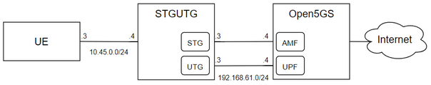

# AGF - Access Gateway Function 

Software Developed by [UPM RSTI Research group](https://blogs.upm.es/rsti).

- **branch/feature#1**
  - **Description**: To be completed
  - **Status of develop**: To be completed
  - **5G Core compatibility**: Open5gs/free5gc

- **branch/feature#2**
  - **Description**: To be completed
  - **Status of develop**: To be completed
  - **5G Core compatibility**: Open5gs/free5gc

- **branch/feature#3**
  - **Description**: To be completed
  - **Status of develop**: To be completed
  - **5G Core compatibility**: Open5gs/free5gc

# Index
- [AGF Dependencies](https://github.com/UPM-RSTI/AGF#Dependencies)
- [5G Core Installation](https://github.com/UPM-RSTI/AGF/blob/main/README.md#5g-core-installation)
- [AGF Installation](https://github.com/UPM-RSTI/AGF#AGF-Installation)
- [Configuration](https://github.com/UPM-RSTI/AGF#Configuraton)
- [Run](https://github.com/UPM-RSTI/AGF#Run)
- [Examples](https://github.com/UPM-RSTI/AGF#Examples)
- [FAQ](https://github.com/UPM-RSTI/AGF#FAQ)

## AGF Dependencies
```
go version: >= 1.20 (Tested with 1.20 and 1.21.4)
```
- Step 1: Download go.
Go to the official Go Downloads (https://go.dev/dl/) page and download the latest .tar.gz archive for Linux.

- Step 2: Step 2: Install Golang
```
sudo tar -C /usr/local -xzf go1.x.x.linux-amd64.tar.gz
```
(Replace go1.x.x with the actual version you downloaded.)

Step 3: Set Up Environment Variables
Add Go’s bin directory to your PATH.

Open your shell profile (.bashrc, .bash_profile, or .zshrc).
Add the following line:
```
export PATH=$PATH:/usr/local/go/bin
```
Save the file and reload it:
```
source ~/.bashrc
```

Step 4: Verify Installation
Check if Go is installed correctly:
```
go version
```


```
sudo apt-get install libpcap-dev
```

## 5G Core Installation
- [free5gc](https://github.com/UPM-RSTI/AGF/wiki/Core-5G-%E2%80%90-free5gc)
- [open5gs](https://github.com/UPM-RSTI/AGF/wiki/Core-5G-%E2%80%90-open5gs)
  
## AGF Installation
### Build executable

```
go build
```


## Configuration
*To be complete

### Specific configuration guide
```
nano src/config.yaml
```
- [AGF-free5gc](https://github.com/UPM-RSTI/AGF/wiki/AGF-%E2%80%90-Free5gc-configuration)
- [AGF-open5gs](https://github.com/UPM-RSTI/AGF/wiki/AGF-%E2%80%90-Open5gs-configuration)
  

## Run
### Run executable
```
stgutgmain 
```
or
```
stgutgmain -t 
```
for testing mode

---

## Examples
*To be complete

## FAQ
*To be complete

 


########## OLD README - Under Reconstruction #################

 

# STGUTG

STGUTG (Signaling Traffic Generation/User Traffic Generation) is a software created for the generation of both signal and user traffic to be sent to a 5G network core. It is based on implementations from the [Free5GC](https://www.free5gc.org/) project and is distributed under an Apache 2.0 license.

Developed by [UPM RSTI Research group](https://blogs.upm.es/rsti).

In this repository, the software has been adapted for use with [Open5GS](https://open5gs.org/).


## Example: Deployment scenario with Open5GS



This is a network scenario in which we are going to use Open5GS and the STGUTG to give Internet access to a virtual machine. The scenario consists of 3 VMs as it is represented in the picture. 

[Open5GS](https://open5gs.org/) is an open-source project for 5th generation (5G) mobile core networks, which intends to implement the 5G core network (5GC) defined in 3GPP Release 17 (R17). In this example, we use the NFs implemented in Open5GS to deploy a 5G core and then test the STGUTG software.


 


### 4. UE VM configuration 

Create an interface to reach the STGUTG VM and make a default route to make all the traffic reach the STGUTG. Set MTU to 1400B.


```
sudo ifconfig enp0s3 10.45.0.3 netmask 255.255.255.0 mtu 1400 up
```
```
sudo ip route add default via 10.45.0.4
```

### 5. Run the scenario

1. In Open5GS VM, execute in the Open5GS folder the following commands. This will start the NFs of the 5G core:

```
sudo systemctl restart open5gs-mmed
sudo systemctl restart open5gs-sgwcd
sudo systemctl restart open5gs-smfd
sudo systemctl restart open5gs-amfd
sudo systemctl restart open5gs-sgwud
sudo systemctl restart open5gs-upfd
sudo systemctl restart open5gs-hssd
sudo systemctl restart open5gs-pcrfd
sudo systemctl restart open5gs-nrfd
sudo systemctl restart open5gs-scpd
sudo systemctl restart open5gs-seppd
sudo systemctl restart open5gs-ausfd
sudo systemctl restart open5gs-udmd
sudo systemctl restart open5gs-pcfd
sudo systemctl restart open5gs-nssfd
sudo systemctl restart open5gs-bsfd
sudo systemctl restart open5gs-udrd
sudo systemctl restart open5gs-webui
```

2.  run the STGUTG software:
```
sudo ./stgutgmain
```

3. Use the UE VM to send traffic through the core to any Internet-based service (ping to 8.8.8.8 should suffice to test if the configuration is successful).

---
